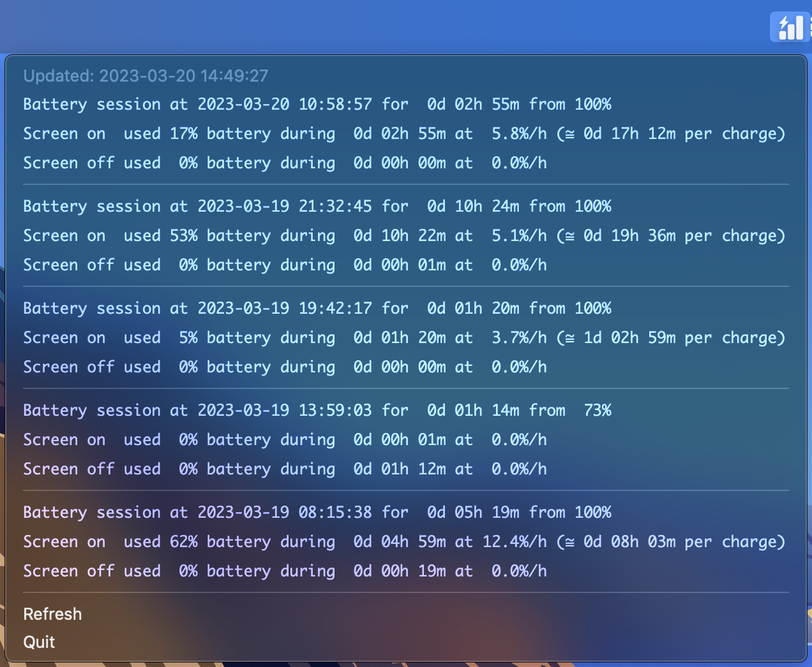

[](https://github.com/almann/mac-battery-usage/actions?query=workflow%3A%22Build+and+test%22)
[](https://github.com/almann/mac-battery-usage/blob/main/LICENSE)


# Battery Usage for macOS

This is a simple utility that is based on [this question][stack] on Stack Overflow and the associated [script][script]
in Github by [DudNr33](https://github.com/DudeNr33).  I started by fixing up the script, but wanted to change a lot
of the mechanics of the script to make it a bit easier to test and embed in other contexts (such as a menu bar app).

Download the latest build binary from releases to run as an application in your menubar.



[stack]: https://apple.stackexchange.com/questions/423962/get-total-screen-on-usage-since-last-full-charge
[script]: https://github.com/DudeNr33/screen-on-time

## Development

Using virtual environments is recommended along with installing Python via `pyenv` for Python 3.11 or higher:

```shell
$ (python3 -m venv ./venv && \
    source ./venv/bin/activate && \
    pip3 --require-virtualenv install -U pip setuptools wheel build black pytest py2app rumps && \
    pip3 --require-virtualenv install -e .)
```

Within the virtual environment, the script can be run as a module:

```shell
$ python3 -m mac_battery_usage
```

The menubar application can be run as follows:

```shell
$ python3 -m mac_battery_usage.menubar
```

The macOS application bundle can be created with:

```shell
$ (rm -fr build dist && python3 setup.py py2app)
```

The unit tests can be run with `pytest`:

```shell
$ pytest
```

The application bundle and installer DMG can be built with:

```shell
$ ./build-dmg.sh
```

Cleaning up the editable install can be done via:

```shell
$ (source ./venv/bin/activate && \
    pip3 --require-virtual-env uninstall mac-battery-usage && \
    git clean -d -X -f src)
```
